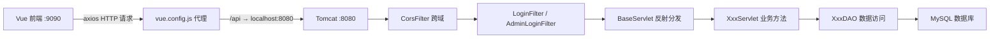
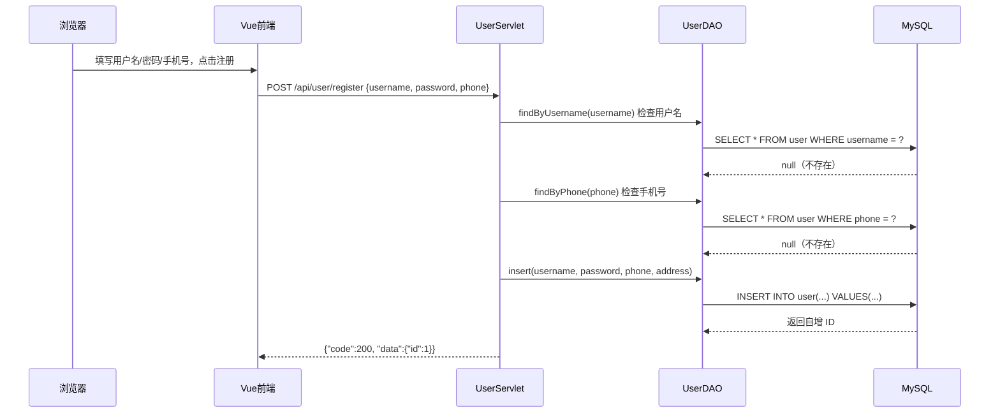
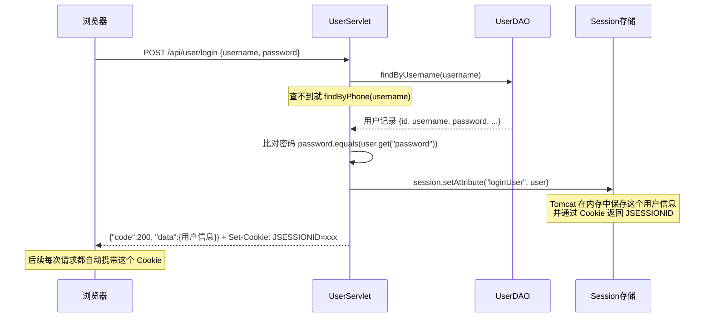
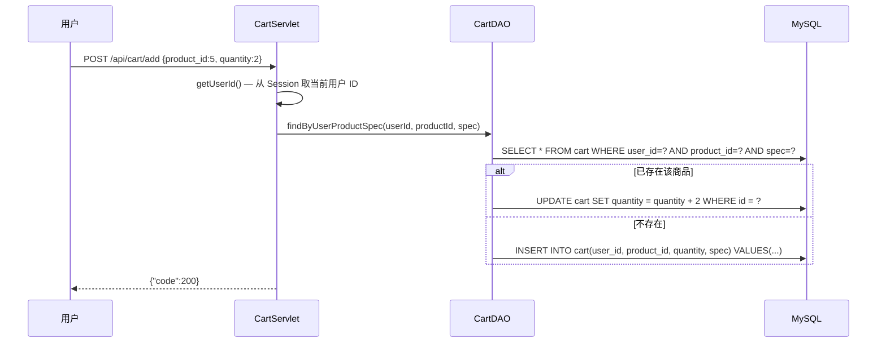
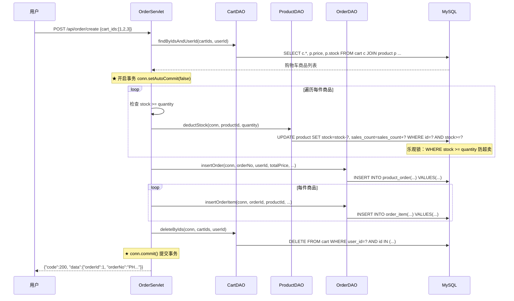
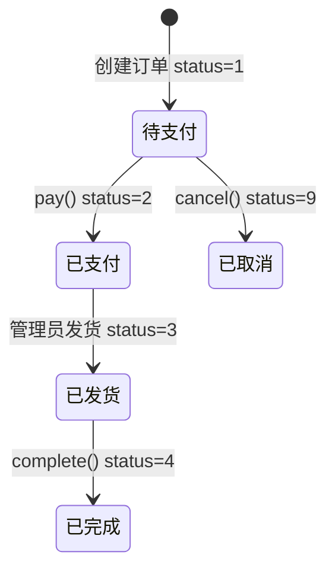
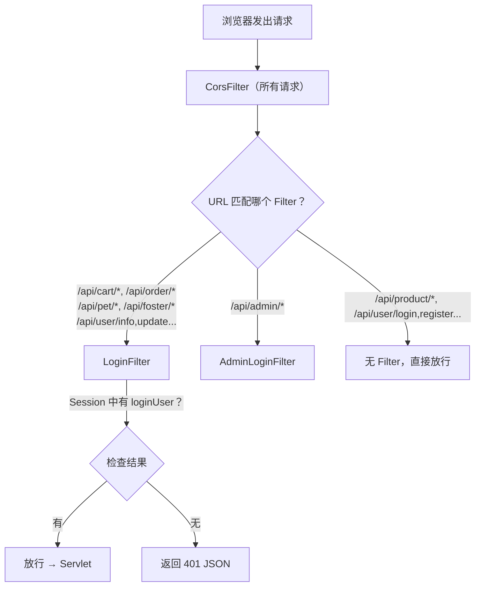

# PetHome 项目核心模块详解

> [!NOTE]
> 本项目是一个**前后端分离**的宠物商城系统。后端用 **Java Servlet + JDBC** 运行在 Tomcat 上；前端用 **Vue 2 + Element UI** 通过 axios 发 HTTP 请求与后端交互。

---

## 一、整体架构概览



**关键文件一览：**

| 层次 | 文件 | 作用 |
|------|------|------|
| 前端请求封装 | `frontend/src/utils/request.js` | 创建 axios 实例，统一拦截 |
| 前端 API | `frontend/src/api/user.js` 等 | 每个模块的 API 函数 |
| Servlet 配置 | `backend/src/main/webapp/WEB-INF/web.xml` | URL 映射 + 过滤器配置 |
| 基类 Servlet | `BaseServlet.java` | 反射分发请求到子类方法 |
| 业务 Servlet | `UserServlet.java`, `CartServlet.java` 等 | 处理具体业务逻辑 |
| DAO 层 | `UserDAO.java`, `CartDAO.java` 等 | 执行 SQL 操作数据库 |
| 过滤器 | `CorsFilter.java`, `LoginFilter.java` | 安全拦截 |
| 数据库工具 | `DBUtil.java` | DBCP2 连接池管理 |

---

## 二、核心基础设施（先理解这些，后面的模块才能看懂）

### 2.1 BaseServlet —— 请求自动分发

所有业务 Servlet 都继承 `BaseServlet`。它的核心思想是：**根据 URL 路径自动调用子类中同名的方法**（用 Java 反射实现）。

```java
// BaseServlet.java 核心逻辑
protected void service(HttpServletRequest req, HttpServletResponse resp) {
    req.setCharacterEncoding("UTF-8");
    resp.setContentType("application/json;charset=utf-8");

    // 例如请求 /api/user/login → pathInfo = "/login"
    String pathInfo = req.getPathInfo();       // 得到 "/login"
    String methodName = pathInfo.substring(1); // 得到 "login"

    // 用反射找到子类（如 UserServlet）中的 login 方法并调用
    Method method = this.getClass().getDeclaredMethod(
        methodName, HttpServletRequest.class, HttpServletResponse.class);
    method.invoke(this, req, resp);
}
```

**通俗理解：** 当浏览器请求 `/api/user/login` 时，Tomcat 根据 `web.xml` 找到 `UserServlet`，`BaseServlet.service()` 提取出 `login`，然后自动调用 `UserServlet.login()` 方法。**开发者只需在子类中写同名方法即可，无需写一堆 if-else。**

### 2.2 DBUtil —— 数据库连接池

```java
// DBUtil.java — 使用 DBCP2 连接池
static {
    Properties props = new Properties();
    props.load(DBUtil.class.getClassLoader().getResourceAsStream("db.properties"));
    dataSource = new BasicDataSource();
    dataSource.setUrl(props.getProperty("db.url"));
    // ... 配置用户名、密码、连接池大小
}
public static Connection getConnection() throws SQLException {
    return dataSource.getConnection(); // 从连接池借一个连接
}
```

### 2.3 前端 axios 封装

```javascript
// frontend/src/utils/request.js
const service = axios.create({
  baseURL: '/api',           // 所有请求自动加 /api 前缀
  timeout: 10000,
  withCredentials: true      // ★ 关键：携带 Cookie（Session 依赖这个）
})

// 响应拦截器：统一处理错误
service.interceptors.response.use(response => {
  if (res.code === 401) {    // 未登录 → 自动跳转登录页
    store.dispatch('logout')
    router.push('/login')
  }
})
```

`vue.config.js` 中配置了代理：前端 `:9090` 的 `/api` 请求 → 转发到后端 `:8080/pet_home`。

---

## 三、用户模块

### 3.1 注册流程



**后端关键代码（UserServlet.register）：**
```java
protected void register(HttpServletRequest req, HttpServletResponse resp) {
    Map<String, Object> body = parseBody(req);  // 读取 JSON 请求体
    String username = (String) body.get("username");
    String password = (String) body.get("password");
    String phone = (String) body.get("phone");

    // 唯一性校验
    if (userDAO.findByUsername(username.trim()) != null) {
        renderError(resp, 400, "用户名已存在"); return;
    }
    if (userDAO.findByPhone(phone.trim()) != null) {
        renderError(resp, 400, "手机号已被注册"); return;
    }

    long userId = userDAO.insert(username, password, phone, address);
    renderSuccess(resp, Map.of("id", userId));  // 返回 JSON
}
```

### 3.2 登录流程（Session 机制）



**核心代码：**
```java
protected void login(HttpServletRequest req, HttpServletResponse resp) {
    // ... 参数校验省略
    // 先按用户名查，查不到按手机号查（支持两种登录方式）
    Map<String, Object> user = userDAO.findByUsername(username);
    if (user == null) user = userDAO.findByPhone(username);

    if (!password.equals(user.get("password"))) {
        renderError(resp, 400, "密码错误"); return;
    }

    // ★ 登录成功：把用户信息存入 Session
    HttpSession session = req.getSession(true);  // 创建/获取 Session
    user.remove("password");                      // 不把密码存到 Session
    session.setAttribute("loginUser", user);       // 存入 Session

    renderSuccess(resp, user);
}
```

> [!IMPORTANT]
> **Session 原理：** `req.getSession(true)` 让 Tomcat 在服务器内存中创建一个 Session 对象，并把它的 ID（JSESSIONID）通过 Cookie 返回给浏览器。之后浏览器每次请求都带上这个 Cookie，服务器就能找到对应的 Session，从而知道"谁在访问"。`web.xml` 中配置了 `<session-timeout>30</session-timeout>`，即 30 分钟无操作自动过期。

### 3.3 其他接口

| 接口 | 关键实现 |
|------|----------|
| `logout` | `session.invalidate()` 销毁 Session |
| `info` | 从 Session 取 userId → `userDAO.findById()` 查最新信息 |
| `update` | 白名单字段 `{phone, email, avatar, address}`，动态拼 SQL |
| `changePassword` | 先验证旧密码 → 再 `updatePassword(userId, newPwd)` |

---

## 四、商品模块

### 4.1 商品列表（分页 + 筛选）

**前端调用：**
```javascript
// frontend/src/api/product.js
export function getProductList(params) {
  // GET /api/product/list?keyword=猫粮&pet_type=猫&category=主粮零食&page=1&pageSize=10
  return request({ url: '/product/list', method: 'get', params })
}
```

**后端 ProductDAO.findList() 核心 —— 动态 SQL 拼接：**
```java
public Map<String, Object> findList(String keyword, String petType,
                                     String category, int page, int pageSize) {
    StringBuilder where = new StringBuilder(" WHERE status = 1"); // 只查上架商品
    List<Object> params = new ArrayList<>();

    // 按条件动态追加 WHERE 子句
    if (keyword != null && !keyword.isEmpty()) {
        where.append(" AND name LIKE ?");
        params.add("%" + keyword + "%");          // 模糊匹配
    }
    if (petType != null && !petType.isEmpty()) {
        where.append(" AND pet_type = ?");
        params.add(petType);
    }
    if (category != null && !category.isEmpty()) {
        where.append(" AND category = ?");
        params.add(category);
    }

    // 先查总数（用于分页）
    String countSql = "SELECT COUNT(*) FROM product" + where;
    // 再查当页数据（LIMIT 实现分页）
    String dataSql = "SELECT * FROM product" + where
            + " ORDER BY create_time DESC LIMIT ?, ?";
    // LIMIT (page-1)*pageSize, pageSize → 第2页就是 LIMIT 10, 10
}
```

### 4.2 热销 / 新品

```java
// 热销 Top5：按销量降序
public List<Map<String, Object>> findHot() {
    return queryList("SELECT * FROM product WHERE status=1 ORDER BY sales_count DESC LIMIT 5");
}
// 新品 Top8：按 ID 降序（ID 越大越新）
public List<Map<String, Object>> findNew() {
    return queryList("SELECT * FROM product WHERE status=1 ORDER BY id DESC LIMIT 8");
}
```

### 4.3 搜索接口

```java
// ProductServlet 中 search 直接复用 list 的逻辑
protected void search(HttpServletRequest req, HttpServletResponse resp) {
    list(req, resp); // 完全相同的参数和逻辑
}
```

---

## 五、购物车模块

> [!IMPORTANT]
> 购物车所有接口都需要登录。`LoginFilter` 会在请求到达 `CartServlet` 之前检查 Session。

### 5.1 加入购物车



**核心代码：**
```java
protected void add(HttpServletRequest req, HttpServletResponse resp) {
    long userId = getUserId(req);  // 从 Session 获取用户 ID
    // ... 解析 product_id, quantity

    // 关键逻辑：已有则累加，没有则新增
    Map<String, Object> existing = cartDAO.findByUserProductSpec(userId, productId, spec);
    if (existing != null) {
        cartDAO.addQuantity(existing.get("id"), quantity);  // 累加数量
    } else {
        cartDAO.insert(userId, productId, quantity, spec);  // 新增记录
    }
}
```

### 5.2 购物车列表（JOIN 查询）

```java
// CartDAO — 联表查询，把商品信息一起带出来
public List<Map<String, Object>> findListByUserId(long userId) {
    String sql = "SELECT c.id, c.quantity, c.spec, "
        + "p.name AS product_name, p.image AS product_image, p.price, p.stock "
        + "FROM cart c LEFT JOIN product p ON c.product_id = p.id "
        + "WHERE c.user_id = ? ORDER BY c.create_time DESC";
}
```

### 5.3 删除 / 清空

```java
// 删除时加 user_id 条件 → 防止用户删除别人的购物车记录
"DELETE FROM cart WHERE id = ? AND user_id = ?"

// 清空
"DELETE FROM cart WHERE user_id = ?"
```

---

## 六、商城订单模块

### 6.1 创建订单（最复杂的业务，使用数据库事务）



**核心代码：**
```java
protected void create(HttpServletRequest req, HttpServletResponse resp) {
    // 1. 查询购物车中选中的商品
    List<Map<String, Object>> cartItems = cartDAO.findByIdsAndUserId(cartIds, userId);

    Connection conn = DBUtil.getConnection();
    conn.setAutoCommit(false); // ★ 关闭自动提交，开启事务

    try {
        // 2. 校验库存 + 扣减库存（乐观锁）
        for (Map<String, Object> item : cartItems) {
            int rows = productDAO.deductStock(conn, productId, quantity);
            if (rows == 0) { conn.rollback(); return; } // 库存不足就回滚
        }

        // 3. 生成订单号 "PH" + 时间戳 + 4位随机数
        String orderNo = orderDAO.generateOrderNo();

        // 4. 写入主订单表 product_order（状态=1 待支付）
        long orderId = orderDAO.insertOrder(conn, orderNo, userId, totalPrice, ...);

        // 5. 写入订单明细表 order_item
        for (Map<String, Object> item : cartItems) {
            orderDAO.insertOrderItem(conn, orderId, productId, productName, price, quantity, spec);
        }

        // 6. 清除已结算的购物车记录
        cartDAO.deleteByIds(conn, cartIds, userId);

        conn.commit(); // ★ 全部成功才提交
    } catch (Exception e) {
        conn.rollback(); // ★ 任何异常都回滚，保证数据一致性
    }
}
```

> [!IMPORTANT]
> **事务的意义：** 扣库存、建订单、删购物车这几步必须"要么全成功，要么全失败"。如果扣了库存但建订单失败，就会出现"库存减少了但没有订单"的数据不一致问题。`conn.setAutoCommit(false)` + `conn.commit()` / `conn.rollback()` 保证了原子性。

> **乐观锁防超卖：** `WHERE stock >= ?` 这个条件让数据库自己检查库存是否足够，即使多个用户同时下单，也只有库存足够的请求能成功执行 UPDATE。

### 6.2 订单状态流转



```java
// 模拟支付：只有 status=1 的订单才能支付
"UPDATE product_order SET status=2, pay_time=NOW() WHERE id=? AND user_id=? AND status=1"

// 确认收货：只有 status=3（已发货）的订单才能确认
"UPDATE product_order SET status=4, receive_time=NOW() WHERE id=? AND user_id=? AND status=3"

// 取消订单：只有 status=1（未支付）的订单才能取消
"UPDATE product_order SET status=9 WHERE id=? AND user_id=? AND status=1"
```

### 6.3 订单列表（分页 + 嵌套查询订单项）

```java
// OrderDAO.findListByUserId — 先查订单，再循环查每个订单的明细
List<Map<String, Object>> list = ...; // SELECT * FROM product_order WHERE user_id=? LIMIT ?,?

for (Map<String, Object> order : list) {
    long orderId = order.get("id");
    order.put("items", findOrderItems(conn, orderId));
    // SELECT * FROM order_item WHERE order_id = ?
}
```

---

## 七、安全与过滤器机制

### 7.1 请求处理链



### 7.2 CorsFilter（跨域过滤器）

```java
public void doFilter(ServletRequest req, ServletResponse resp, FilterChain chain) {
    // 允许前端跨域请求（前端 :9090 → 后端 :8080）
    resp.setHeader("Access-Control-Allow-Origin", origin);
    resp.setHeader("Access-Control-Allow-Methods", "GET, POST, PUT, DELETE, OPTIONS");
    resp.setHeader("Access-Control-Allow-Credentials", "true"); // ★ 允许携带 Cookie

    // OPTIONS 预检请求直接返回 200（浏览器跨域前会先发 OPTIONS 探路）
    if ("OPTIONS".equalsIgnoreCase(req.getMethod())) {
        resp.setStatus(200); return;
    }
    chain.doFilter(req, resp); // 放行给下一个 Filter
}
```

### 7.3 LoginFilter（用户登录过滤器）

```java
public void doFilter(ServletRequest req, ServletResponse resp, FilterChain chain) {
    if ("OPTIONS".equalsIgnoreCase(req.getMethod())) {
        chain.doFilter(req, resp); return; // OPTIONS 放行
    }

    HttpSession session = req.getSession(false); // false = 不创建新 Session
    if (session != null && session.getAttribute("loginUser") != null) {
        chain.doFilter(req, resp); // ★ 已登录，放行
    } else {
        resp.setStatus(401);
        // 返回 JSON：{"code":401, "msg":"请先登录"}
    }
}
```

### 7.4 web.xml 中的配置

```xml
<!-- CorsFilter 拦截所有请求 -->
<filter-mapping>
    <filter-name>CorsFilter</filter-name>
    <url-pattern>/*</url-pattern>
</filter-mapping>

<!-- LoginFilter 拦截需要登录的接口 -->
<filter-mapping>
    <filter-name>LoginFilter</filter-name>
    <url-pattern>/api/cart/*</url-pattern>
</filter-mapping>
<filter-mapping>
    <filter-name>LoginFilter</filter-name>
    <url-pattern>/api/order/*</url-pattern>
</filter-mapping>
<filter-mapping>
    <filter-name>LoginFilter</filter-name>
    <url-pattern>/api/user/info</url-pattern>
</filter-mapping>
<!-- ... 等等 -->

<!-- AdminLoginFilter 拦截管理端 -->
<filter-mapping>
    <filter-name>AdminLoginFilter</filter-name>
    <url-pattern>/api/admin/*</url-pattern>
</filter-mapping>

<!-- Session 超时 30 分钟 -->
<session-config>
    <session-timeout>30</session-timeout>
</session-config>
```

### 7.5 访问控制汇总

| 接口范围 | 过滤器 | 未登录处理 |
|----------|--------|-----------|
| `/api/cart/*`, `/api/order/*`, `/api/pet/*`, `/api/foster/*` | LoginFilter | 返回 401 |
| `/api/user/info`, `update`, `logout`, `changePassword` | LoginFilter | 返回 401 |
| `/api/product/*`, `/api/user/login`, `/api/user/register`, `/api/store/*` | 无 | 直接放行 |
| `/api/admin/*` | AdminLoginFilter | 返回 401 |

### 7.6 前端如何配合安全机制

```javascript
// request.js — 响应拦截器
service.interceptors.response.use(
  response => {
    if (res.code === 401) {
      store.dispatch('logout')   // 清除本地状态
      router.push('/login')      // 跳转登录页
    }
  },
  error => {
    if (error.response && error.response.status === 401) {
      Message.error('请先登录')
      router.push('/login')
    }
  }
)
```

**前端收到 401 后自动跳转登录页，形成完整的安全闭环。**
