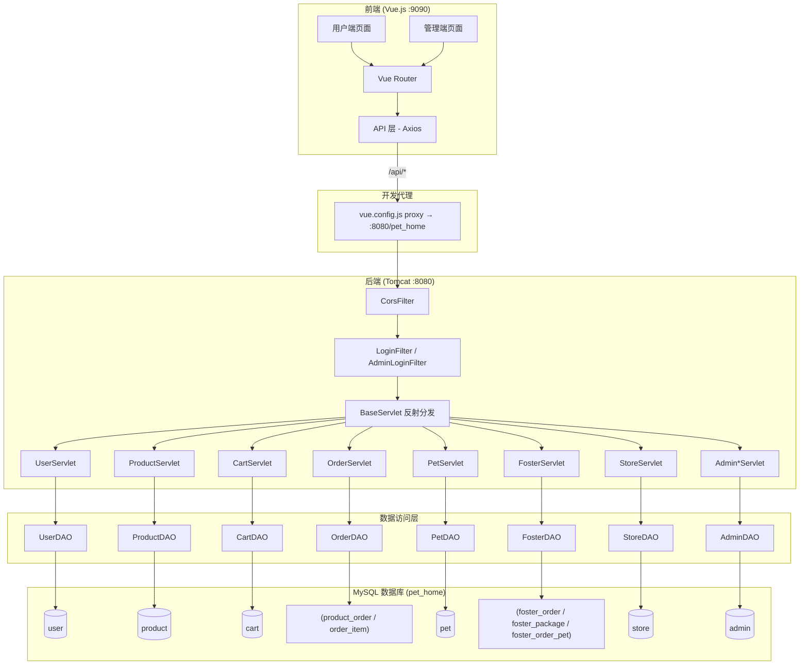
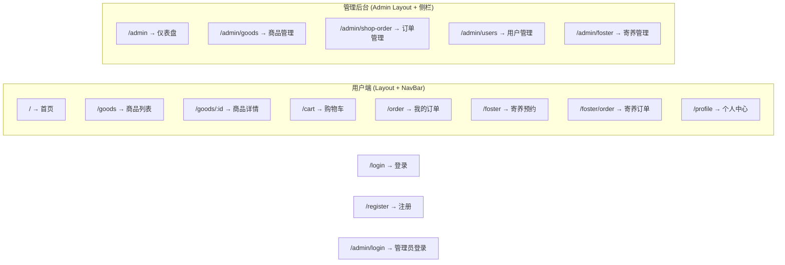
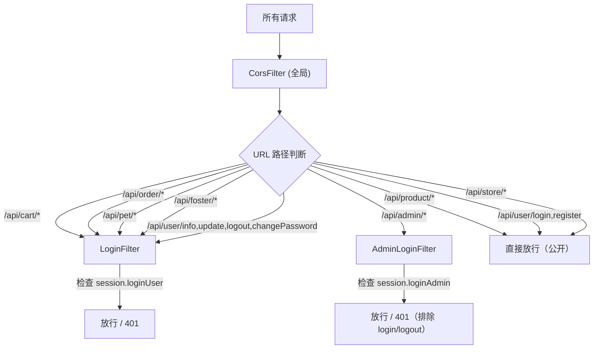

# 🐾 PetHome（宠物之家）项目功能结构分析文档

## 1. 项目概述

**PetHome** 是一个**宠物综合服务平台**，提供宠物用品在线商城和宠物寄养预约两大核心业务。项目采用前后端分离架构，面向**普通用户**和**管理员**两种角色，涵盖商品浏览购买、购物车、订单管理、宠物档案管理、寄养预约以及后台管理等完整业务流程。

---

## 2. 技术栈

| 层级 | 技术 | 版本 |
|------|------|------|
| **前端框架** | Vue.js | 2.6 |
| **UI 组件库** | Element UI | 2.15 |
| **路由** | Vue Router | 3.x (history mode) |
| **状态管理** | Vuex | 3.x |
| **HTTP 客户端** | Axios | 0.21 |
| **后端** | Java Servlet (Jakarta EE) | 6.0 |
| **构建工具** | Maven (WAR 包) | Java 1.8 |
| **数据库** | MySQL (阿里云 RDS) | 8.0 |
| **连接池** | Apache DBCP2 | 2.9 |
| **JSON 序列化** | Fastjson | 1.2.83 |
| **文件上传** | Commons FileUpload2 (Jakarta) | 2.0.0-M5 |
| **前端构建** | Vue CLI | 4.5 |

---

## 3. 项目目录结构

```
pet-home/
├── backend/                        # Java 后端（Maven WAR 工程）
│   ├── pom.xml
│   └── src/main/
│       ├── java/com/pethome/
│       │   ├── dao/                # 数据访问层（8 个 DAO）
│       │   │   ├── AdminDAO.java
│       │   │   ├── CartDAO.java
│       │   │   ├── FosterDAO.java
│       │   │   ├── OrderDAO.java
│       │   │   ├── PetDAO.java
│       │   │   ├── ProductDAO.java
│       │   │   ├── StoreDAO.java
│       │   │   └── UserDAO.java
│       │   ├── filter/             # 过滤器层（3 个 Filter）
│       │   │   ├── CorsFilter.java
│       │   │   ├── LoginFilter.java
│       │   │   └── AdminLoginFilter.java
│       │   ├── servlet/            # 控制层（13 个 Servlet）
│       │   │   ├── BaseServlet.java         # 基类（反射分发）
│       │   │   ├── UserServlet.java
│       │   │   ├── ProductServlet.java
│       │   │   ├── CartServlet.java
│       │   │   ├── OrderServlet.java
│       │   │   ├── PetServlet.java
│       │   │   ├── FosterServlet.java
│       │   │   ├── StoreServlet.java
│       │   │   ├── AdminLoginServlet.java
│       │   │   ├── AdminProductServlet.java
│       │   │   ├── AdminOrderServlet.java
│       │   │   ├── AdminUserServlet.java
│       │   │   └── AdminFosterServlet.java
│       │   ├── util/
│       │   │   └── DBUtil.java              # DBCP2 连接池工具
│       │   ├── ReadCategories.java          # 独立工具类
│       │   ├── ReadProducts.java
│       │   ├── UpdateCategories.java
│       │   └── ExportProducts.java
│       ├── resources/
│       │   └── db.properties                # 数据库配置
│       └── webapp/WEB-INF/
│           └── web.xml                      # Servlet/Filter 映射
│
└── frontend/                       # Vue.js 前端
    ├── package.json
    ├── vue.config.js               # 开发代理 → localhost:8080/pet_home
    └── src/
        ├── App.vue
        ├── main.js
        ├── api/                    # API 封装（8 个模块）
        │   ├── admin.js, cart.js, foster.js
        │   ├── order.js, pet.js, product.js
        │   ├── store.js, user.js
        ├── components/
        │   └── NavBar.vue          # 全局导航栏
        ├── router/index.js         # 路由配置
        ├── store/index.js          # Vuex 状态管理
        ├── utils/request.js        # Axios 封装（拦截器）
        └── views/
            ├── Home.vue            # 首页
            ├── GoodsList.vue       # 商品列表
            ├── GoodsDetail.vue     # 商品详情
            ├── Cart.vue            # 购物车
            ├── OrderList.vue       # 我的订单
            ├── Foster.vue          # 寄养预约
            ├── FosterOrder.vue     # 寄养订单
            ├── Profile.vue         # 个人中心
            ├── Login.vue           # 登录
            ├── Register.vue        # 注册
            ├── Layout.vue          # 用户端布局
            └── admin/              # 管理后台
                ├── Layout.vue
                ├── AdminLogin.vue
                ├── Dashboard.vue
                ├── GoodsManage.vue
                ├── ShopOrderManage.vue
                ├── UserManage.vue
                └── FosterManage.vue
```

---

## 4. 系统架构



---

## 5. 核心功能模块

### 5.1 用户模块

| 接口 | 方法 | 说明 |
|------|------|------|
| `/api/user/register` | POST | 注册（用户名+手机号唯一校验） |
| `/api/user/login` | POST | 登录（支持用户名/手机号） |
| `/api/user/logout` | POST | 退出登录 |
| `/api/user/info` | GET | 获取当前用户信息（需登录） |
| `/api/user/update` | POST | 修改个人信息 |
| `/api/user/changePassword` | POST | 修改密码（验证旧密码） |

> **认证方式**: 基于 HttpSession，登录后将用户信息存入 `session.loginUser`。

### 5.2 商品模块

| 接口 | 方法 | 说明 |
|------|------|------|
| `/api/product/list` | GET | 商品列表（分页 + keyword/pet_type/category 筛选） |
| `/api/product/detail` | GET | 商品详情 |
| `/api/product/hot` | GET | 热销商品 Top 5 |
| `/api/product/new` | GET | 新品上架 Top 8 |
| `/api/product/all` | GET | 全部上架商品 |
| `/api/product/search` | GET | 搜索（复用 list 逻辑） |

**商品分类**: 主粮零食、宠物窝笼、洗护用品、玩具、服饰、外出用品  
**宠物类型**: 猫、狗、通用

### 5.3 购物车模块（需登录）

| 接口 | 方法 | 说明 |
|------|------|------|
| `/api/cart/add` | POST | 加入购物车（已有则累加数量） |
| `/api/cart/list` | GET | 购物车列表 |
| `/api/cart/update` | POST | 修改数量 |
| `/api/cart/delete` | POST | 删除单条 |
| `/api/cart/remove` | POST | 删除（兼容命名） |
| `/api/cart/clear` | POST | 清空购物车 |

### 5.4 商城订单模块（需登录）

| 接口 | 方法 | 说明 |
|------|------|------|
| `/api/order/create` | POST | 创建订单（事务：校验库存→扣库存→生成订单→写明细→清购物车） |
| `/api/order/list` | GET | 我的订单列表（分页 + 状态筛选） |
| `/api/order/detail` | GET | 订单详情 |
| `/api/order/pay` | POST | 模拟支付（1→2） |
| `/api/order/complete` | POST | 确认收货（3→4） |
| `/api/order/receive` | POST | 确认收货（兼容命名） |
| `/api/order/cancel` | POST | 取消订单（1→9） |

**订单状态流转**:
```
1(未支付) → 2(已支付/待发货) → 3(已发货/待收货) → 4(已完成)
1(未支付) → 9(已取消)
```

**配送方式**: 1=快递送货, 2=门店自提

### 5.5 宠物管理模块（需登录）

| 接口 | 方法 | 说明 |
|------|------|------|
| `/api/pet/list` | GET | 我的宠物列表 |
| `/api/pet/detail` | GET | 宠物详情 |
| `/api/pet/add` | POST | 添加宠物 |
| `/api/pet/update` | POST | 修改宠物信息 |
| `/api/pet/delete` | POST | 删除宠物 |

宠物属性: 名称、物种、品种、年龄、性别、体重、照片、健康状态、备注。

### 5.6 寄养服务模块（需登录）

| 接口 | 方法 | 说明 |
|------|------|------|
| `/api/foster/package/list` | GET | 寄养套餐列表 |
| `/api/foster/package/detail` | GET | 套餐详情 |
| `/api/foster/order/create` | POST | 创建寄养订单（事务） |
| `/api/foster/order/list` | GET | 我的寄养订单 |
| `/api/foster/order/detail` | GET | 寄养订单详情 |
| `/api/foster/order/cancel` | POST | 取消寄养订单 |
| `/api/foster/order/pay` | POST | 寄养订单支付 |

**寄养订单状态**: 待审核 → 已审核(待支付) → 已支付(待入住) → 已入住 → 已完成 / 已驳回 / 已取消

### 5.7 门店模块

| 接口 | 方法 | 说明 |
|------|------|------|
| `/api/store/list` | GET | 获取所有启用门店列表 |

---

## 6. 管理后台模块

### 6.1 管理员认证

| 接口 | 说明 |
|------|------|
| `/api/admin/login` | 管理员登录（Session: `loginAdmin`） |
| `/api/admin/logout` | 管理员退出 |
| `/api/admin/info` | 获取管理员信息 |

### 6.2 商品管理

| 接口 | 说明 |
|------|------|
| `/api/admin/product/list` | 商品列表（支持全状态查询） |
| `/api/admin/product/add` | 新增商品（支持图片上传 multipart） |
| `/api/admin/product/update` | 修改商品（支持图片替换） |
| `/api/admin/product/delete` | 软删除商品（status → 0） |

### 6.3 订单管理

| 接口 | 说明 |
|------|------|
| `/api/admin/order/list` | 订单列表（JOIN user 表，多条件筛选） |
| `/api/admin/order/ship` | 发货操作（2→3） |
| `/api/admin/order/ready` | 自提备货完成（2→3） |

### 6.4 用户管理

| 接口 | 说明 |
|------|------|
| `/api/admin/user/list` | 用户列表（分页 + 用户名/手机号搜索） |
| `/api/admin/user/update` | 修改用户信息 |
| `/api/admin/user/delete` | 删除用户（事务级联删除关联数据） |
| `/api/admin/user/profile` | 用户画像（宠物、订单、寄养记录） |

### 6.5 寄养订单管理

| 接口 | 说明 |
|------|------|
| `/api/admin/foster/list` | 寄养订单列表（多条件筛选） |
| `/api/admin/foster/approve` | 审批通过 |
| `/api/admin/foster/reject` | 驳回（含原因） |
| `/api/admin/foster/checkin` | 宠物入住 |
| `/api/admin/foster/complete` | 寄养完成 |
| `/api/admin/foster/monthly` | 月度统计 |

---

## 7. 前端路由结构



---

## 8. 数据库表结构（推断）

根据代码中的 SQL 语句和字段引用，推断出以下数据库表：

| 表名 | 说明 | 主要字段 |
|------|------|----------|
| `user` | 用户表 | id, username, password, phone, email, avatar, address, create_time, update_time |
| `admin` | 管理员表 | id, username, password, phone |
| `product` | 商品表 | id, name, category, pet_type, price, stock, sales_count, image, description, spec, status, create_time, update_time |
| `cart` | 购物车 | id, user_id, product_id, quantity, spec |
| `product_order` | 商城订单 | id, order_no, user_id, total_price, status, delivery_method, store_id, receiver_name, receiver_phone, receiver_address, remark, ship_time, create_time |
| `order_item` | 订单明细 | id, order_id, product_id, product_name, price, quantity, spec |
| `pet` | 宠物表 | id, user_id, name, species, breed, age, gender, weight, image, health_status, remark, create_time, update_time |
| `foster_package` | 寄养套餐 | id, name, price, description |
| `foster_order` | 寄养订单 | id, order_no, user_id, package_id, start_date, end_date, total_days, total_price, status, remark, reject_reason, create_time |
| `foster_order_pet` | 寄养订单-宠物关联 | id, foster_order_id, pet_id |
| `store` | 门店表 | id, name, address, ... |

---

## 9. 安全与过滤器机制



**关键设计**:
- **CORS**: 开发阶段允许所有来源，支持凭证 (`credentials: true`)
- **Session 超时**: 30 分钟
- **OPTIONS 预检**: 所有过滤器均放行 OPTIONS 请求
- **前端拦截器**: 401 响应自动登出并跳转登录页

---

## 10. 核心设计模式

### BaseServlet 反射分发
所有 Servlet 继承 `BaseServlet`，基类通过 URL 的 `pathInfo` 自动反射调用子类对应方法，避免在每个 Servlet 中手写 if/else 路由：

```
请求: POST /api/user/login
  → pathInfo = "/login"
  → 反射调用 UserServlet.login(req, resp)
```

### 统一响应格式
```json
// 成功
{ "code": 200, "msg": "ok", "data": { ... } }
// 失败
{ "code": 400/401/500, "msg": "错误信息" }
```

### 事务管理
订单创建（商城和寄养）均使用手动事务：获取连接 → 关闭自动提交 → 执行操作 → 提交/回滚，确保数据一致性。库存扣减使用乐观锁。

---

## 11. 前端特性总结

- **响应式导航栏**: 橙色渐变风格，登录状态下显示用户名和红点徽章（待收货提醒）
- **首页**: 搜索栏（宠物类型+分类筛选）+ 分类卡片 + 热销好物横向滚动 + 新品网格
- **商品系统**: 列表分页、详情页、加入购物车
- **购物车**: 增删改查、批量结算
- **订单系统**: 创建、支付、收货、取消、状态筛选
- **寄养预约**: 套餐选择、宠物选择、日期范围、价格计算
- **个人中心**: 信息编辑、密码修改、宠物管理
- **管理后台**: 独立布局+侧栏导航，包含仪表盘、商品/订单/用户/寄养管理

---

## 12. 开发/部署配置

| 配置项 | 值 |
|--------|-----|
| 前端开发端口 | `9090` |
| 后端部署路径 | `http://localhost:8080/pet_home` |
| API 代理 | 前端 `/api` → 后端 `/pet_home/api` |
| 数据库 | 阿里云 RDS MySQL (`pet_home` 库) |
| 图片上传路径 | `/uploads/goods/` (服务器 webapp 目录下) |
| WAR 包名 | `pet-home.war` |

> [!NOTE]
> Dashboard 页面的统计数据目前使用硬编码 mock 数据，未对接真实后端接口。
